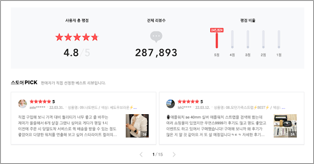

# 인터넷 쇼핑몰 리뷰를 통한 NLP감성분석 파이프라인 구축

1. 서론
    1. 프로젝트 개요
        1. 주제 선정 동기
        2. AS-IS, TO-BE
        3. 기대 효과
        4. 프로젝트 역할 분담
        5. 프로젝트 일정
    2. 프로젝트 환경
        1. 환경 구성
        2. 활용 도구
2. 본론
    1. 수요 분석
    2. 프로세스 분석
        1. 서비스 플로우
        2. 기능 플로우
        3. 데이터 플로우
        4. 인프라 요구사항 명세
    3. 프로세스 설계
        1. 프로세스 아키텍처
        2. 시스템 구성
        3. Usecase 시나리오
        4. 데이터 연동 규격
    4. 프로세스 구현
        1. 인프라 구현
        2. Usecase 기능 구현
    5. 정상 동작 확인
3. 결론
    1. 결과물 활용 방법
    2. 문제점 및 개선 방안
    3. 프로젝트 결과 및 향후 개선점

# 1.1. 프로젝트 개요

---

## 1.1.1. 주제 선정 동기

쇼핑몰의 수익성을 높이기 위해서 쇼핑몰 플랫폼 운영자는 소비자 니즈를 파악하여 고객의 제품 구매를 유도해야 한다. 동시에 수요가 낮은 제품은 어떤 부분(배송 서비스, 제품 자체 등)에서 부정적인 반응이 생성되었는지 파악하여 보완을 해야 한다. 하지만 쇼핑몰 플랫폼 운영자는 단시간에 많은 소비자의 반응을 일일이 확인하기 힘들다.

따라서 본 프로젝트에서는 머신 러닝을 통해 학습한 결과를 바탕으로 리뷰 감성 분석을 진행하여 타겟 키워드를 확인할 수 있는 대시보드를 생성함으로써 쇼핑몰 플랫폼 운영자가 직접 리뷰를 읽지 않아도 단시간에 상품에 대한 소비자 반응을 판단할 수 있도록 한다.

## 1.1.2. AS-IS, TO-BE

**[ AS-IS ]**



온라인 쇼핑몰 판매자가 쇼핑몰의 수익을 높이기 위해서는 고객의 리뷰를 읽고 분석할 필요가 있다. 하지만 판매 기간이 길어질수록 리뷰의 개수는 점점 증가할 것이고 그에 따라 쇼핑몰 판매자가 고객의 리뷰를 일일히 읽고 소비자 반응을 분석하는 것은 더욱 힘들어질 것이다.


판매자가 리뷰를 간략하게 파악하기에 용이한 방법으로 별점이 있지만 별점과 실제 리뷰간에 갭이 상당수 존재하며 이러한 갭은 실제로 판매자에게 혼동을 줄수 있는 요인이다.

**[ TO-BE ]**


고객 쇼핑몰에서 판매하는 제품의 리뷰 중 소비자가 긍정적인 반응을 보이고 있는 리뷰의 키워드를 추출하고, 부정적인 반응을 보이고 있는 리뷰의 키워드를 추출하여 소비자가 어떠한 이유로 고객 쇼핑몰의 제품을 구입하는지 파악할 수 있도록 한다. 또한 동일 제품을 판매하고 있는 타사의 쇼핑몰 리뷰에서 자사 키워드를 기반으로 키워드 개수를 추출하여 고객 쇼핑몰과 타사 쇼핑몰이 어떤 점에서 소비자들의 반응 차이가 발생하고 있는지를 확인할 수 있도록 돕는다. 또한 별점과 리뷰 사이의 긍부정 반응 갭이 얼마나 존재하는지 파악하여 쇼핑몰 운영을 위한 지표로 제공하고자 한다.

## 1.1.3. 기대 효과

**사용자 측면** : 상품에 대한 소비자 반응을 분석해서 키워드로 파악이 가능하게 한다. 타겟 키워드를 설정하기 위한 리서치시간을 줄인다.

**비즈니스 측면** : 상품에 대한 소비자 반응을 분석해서 키워드로 파악이 가능하게 한다. 타겟 키워드를 설정하기 위한 리서치시간을 줄인다.

## 1.1.4. 프로젝트 역할 분담

| 이름 | 직책 | 역할 |
| --- | --- | --- |
| 도효주 | PM | 프로젝트 전체 일정 관리, 문서 작업, 대시보드 구현 |
| 선우지훈 | 팀원 | 텍스트 데이터 정제 및 저장, 대시보드 구현, 인프라 구축(opensearch, logstash, kibana, kafka) |
| 오승우 | 팀원 | 프로젝트 개요 기획, 대시보드 구현, 데이터 프레임 구축 |
| 전중석 | 팀원 | 데이터 크롤링 및 NLP 처리, 데이터 프레임 구축, 인프라 구축, 대시보드 구현 |

## 1.1.4. 프로젝트 일정


# 1.2. 프로젝트 환경

---

## 1.2.1. 환경 구성

| Software | Reason for use |
| --- | --- |
| Virtual Box | Window 환경에서 Ubuntu 환경을 구축하기 위해 설치한
가상화 소프트웨어 |
| Windows Terminal | 명령줄 셸에 대한 호스트 애플리케이션 |
| Vscode | 코드 입력을 용이하게 해주는 소스 코드 에디터 |
| Ubuntu | 리눅스 시스템 자동화에 적합한 OS |

## 1.2.2. 활용 도구

| Software | Reason for use |
| --- | --- |
| Python | 사용자 쇼핑몰 댓글 추출 및 자연어 처리에 사용되는 프로그래밍 언어 |
| AWS CLI | Amazon 서비스 통합 관리 (AWS EKS) |
| Terraform | 클라우드 프로바이더에 IaC 배포 자동화 |
| Docker | 크롤링 파드 이미지 생성 |
| Amazon EKS | AWS 상에서 컨테이너화 된 애플리케이션 관리 자동화 |
| ChromeDriver | 쇼핑몰 댓글 추출 시 랜더링 되는 웹 드라이버 |
| Kafka | 쇼핑몰 추출 댓글 유실 방지 |
| CUDA | GPU의 가상 명령어셋을 사용할 수 있도록 만들어주는 소프트웨어 레이어 |
| cuDNN | 심층 신경망을 위한 GPU 가속 프리미티브 라이브러리 |
| Anaconda | 과학 연구 및 머신러닝 분야에 적합한 Python 및 R 언어의 패키지/의존성 관리 및 배포를 편리하게 해주는 패키지 관리자 |
| Jupyter Notebook | 탐색적 데이터 분석, 데이터 정리 및 변환, 데이터 시각화, 통계적 모델링, 머신 러닝, 딥러닝 등의 각종 데이터 사이언스 문서 생성 애플리케이션 |
| tensorflow | 딥러닝 라이브러리 중 하나이며 Python을 활용하여 연산처리 작성 |
| mecab | 일본어와 한국어의 유사점으로 한글 분석에도 동작하는 것을 확인하고 개발한 한국어 형태소 분석기 |
| Opensearch | 쇼핑몰 댓글 데이터, 감성 분석 결과 데이터 적재 |
| Logstash | Kafka에 저장된 데이터 수집 (Consumer), 쇼핑몰 댓글 데이터 정제 및 인덱싱 |
| Kibana | 댓글 감성 분석 결과 시각화 |

# 2.1. 수요 분석

---

해당 서비스는 특정 쇼핑몰에 입점해있는 사업자, 쇼핑몰 제작 솔루션 업체나 개인 쇼핑몰을 운영하는 사업자들을 소비자로 선정한다. 

### 시장분석

2021년 이커머스 시장 규모는 약 186조 원으로 전년 대비 약 15% 증가했다. 비대면 소비의 확장, 이커머스 산업의 발전등으로 성장 추이는 지속될 것으로 전망된다.


이커머스 업종 광고비는 전년 대비 1,230억이 증가했다. 무신사, 올리브영 과 같은 안정적인 매출과 고객을 확보한 전문 쇼핑몰들이 카테고리를 확장해 나가면서 사업규모를 확대하고 있고 점점 경쟁이 치열해지는 중이다.


이커머스 소비자들을 대상으로 한 조사를 진행


진행 결과 이커머스 소비자들이 가장 크게 관심을 갖는 정보는 구입,배송 후기였고 주 이용 온라인 쇼핑 채널은 네이버와 쿠팡을 가장 많이 이용했다. (연령대별로 다소 차이가 존재함)


쇼핑 채널 주 선택 요인은 가격과 사용후기로 소비자들은 온라인 쇼핑 채널을 선택할때 가격과 사용후기를 주의깊게 보는 것을 확인할수 있었다. 


추가로 온라인에서 구매하는 제품의 정보는 온라인 쇼핑몰과 포털사이트에서 획득함 

온라인 구매시 쇼핑몰에서 즉시 탐색하는 경우가 가장 많았고 해당 정보중 가장 신뢰하는 부분은 후기, 리뷰


이처럼 이커머스 시장의 급속 성장과 동시에 해당 시장의 경쟁이 치열해지고 있다. 소비자들이 제품 구매시 가장 크게 영향을 받는 리뷰를 관리하는 전략으로 경쟁에서의 우위를 점할수 있다.

# 2.2. 프로세스 분석

---

## 2.2.1. 서비스 플로우

---


## **쇼핑몰 댓글 분석 요청하기**

1. 사용자가 온라인 쇼핑몰 댓글 분석을 요청한다.
2. 엔지니어는 크롤러에게 사용자 쇼핑몰의 댓글 추출을 요청한다.
3. 크롤러는 사용자의 쇼핑몰에 접근한여 댓글, 별점, 작성일자를 추출한다.
4. 크롤러는 추출한 데이터를 카프카 브로커의 토픽에 저장한다.

## **쇼핑몰 댓글 데이터 정제 및 저장하기**

1. 토픽에 저장된 데이터를 불러와 특수문자를 제거하고 JSON 포멧으로 변환한다.
2. 정제된 데이터를 인덱싱하여 데이터 적재 서버(Opensearch)에 저장한다.

## **쇼핑몰 댓글 NLP 처리**

1. GRU를 사용하여 자사·타사·유사 쇼핑 리뷰 감성 분류를 진행한다.
2. 데이터 적재 서버에 저장 된 데이터를 불러와 자연어 처리를 한다.
3. 처리 결과를 다시 데이터 적재 서버에 저장한다.

## **분석 결과 시각화**

1. 저장 된 데이터의 인덱스를 기반으로 대시보드 형태로 시각화한다.
2. 사용자에게 해당 대시보드의 주소를 제공한다

## 2.2.2 기능 플로우

---


### **쇼핑몰 URL 환경 변수 설정**

크롤링 파드 생성 시, 쇼핑몰 URL을 환경 변수로 설정하여 크롤링할 쇼핑몰을 지정한다.

### **크롤링**

크롤러 파드는 지정 된 쇼핑몰의 댓글 데이터(별점, 댓글, 작성일자)를 추출한 다. 추출된 데이터는 큐잉 서버의 각 토픽으로 전송한다.

### **토픽 별 데이터 Queueing**

데이터를 큐잉 서버에 저장하게 되면 데이터의 유실을 방지할 수 있다. 각 제품 별로 토픽이 생성되어 있기 때문에 크롤러 파드는 자신의 제품에 해당하는 토픽에 데이터를 전송한다.

### **데이터 정제**

데이터 정제 서버는 (어떤 토픽인지 더 자세하게)토픽을 구독하고 있다가 토픽에 댓글 데이터가 쌓이면 데이터를 끌어와 특수 문자를 제거하고 해당 프로젝트에서 사용하는 형태로 인덱싱한 다음 JSON 포멧으로 변환한다.

### **데이터 적재**

정제를 마친 데이터는 데이터 적재 서버로 전송된다.

### **Slack 알람**

데이터 적재 서버에 데이터가 안전하게 저장되면 Slack에 적재 완료 알림이 전송된다.

### **ML 자연어 처리**

데이터 적재 서버에서 데이터를 가져와 자연어 처리(Word2Vec, Word Cloud, 감성 분석, 분석 정확도, 단어 간 유사도)를 진행한다.

### **처리 결과 저장**

자연어 처리 결과를 데이터 적재 서버에 저장한다.

### **시각화 (대시보드)**

데이터 적재 서버에서 감성 분석 결과를 전송 받아 타겟 키워드를 다양한 차트(Stackbar, Markdown, Data Table 등)를 통해 나타낸다.

## 2.2.3. 데이터 플로우

---


HTML 포멧 쇼핑몰 댓글은 파이썬 크롤러에 의해 추출 되어 일렬의 JSON 포멧으로 변환되고, 이 데이터가 Logstash를 거치면서 인덱싱 및 정제가 되어 multi-row 형태의 JSON 포멧으로 변환된다.

## 2.2.4. 인프라 요구사항 명세

---

## 인프라 요구사항 개요

[Google Docs - 인프라 요구사항 개요](https://docs.google.com/spreadsheets/d/1AvcnUb9na_x5Q2_Ze3zOfuonSRSo6wXi8fp-E4ITsbY/edit#gid=1931931552)

## 인프라 요구사항 명세

[Google Docs - 인프라 요구사항 명세](https://docs.google.com/spreadsheets/d/1AvcnUb9na_x5Q2_Ze3zOfuonSRSo6wXi8fp-E4ITsbY/edit#gid=1058604997)

# 3. 결론

---

## 3.1. 결과물 활용 방안

한국 소비자 연맹에 따르면 인터넷 쇼핑몰 소비자들의 97.2%가 제품 구매 시 리뷰를 참고하여 제품을 구매한다. 그리고 제품이 아무리 좋아 보여도 리뷰가 좋지 않으면 96.7%가 제품을 구매하지 않는다. 이처럼 인터넷 쇼핑몰을 운영하는데 중요한 요소인 리뷰를 해당 서비스를 통해 쉽게 관리 할 수 있다. 감성 분석을 통해 부정적인 리뷰 및 쇼핑몰의 강점도 파악하며 경쟁사들의 리뷰까지 한눈에 파악하며 일자 별로 추적-관리할 수 있다.

## 3.2. **발생 문제(에러) 및 해결 방안**


**💡 크롤링 코드 작동 오류**


- **오류 및 원인**
    
    크롤링하는 데이터 양이 방대해질 경우 특정 사이트에서의 IP 차단
    
    이런 경우 해당 서버에 부하가 걸릴 수 있기 때문에 크롤링 활동을 차단하게 된다. 또한 한동안 해당 사이트에 접속이 불가능해진다.
    

- **해결 방법**
    
    파이썬의 time.sleep() 모듈을 사용하여 중간에 지연시간을 두게 한다.
    
    크롤러가 다음 댓글 페이지를 크롤링하기 위해 넘어갈 때 발생하는 지연을 고려하여 1초로 설정
    


**💡 OOMKilled 오류로 인한 크롤러 파드 강제 종료**


- **오류 및 원인**
    
    메모리가 부족하여 파드를 강제 종료
    

- **해결 방법**
기본적으로 BestEffort → Burstable → Guranteed 순서로 종료된다. 
가용 메모리는 `Pod의 사용중인 메모리 / 한계 메모리 * 100%`로 계산된다.
    
    
    Guranteed QoS 클래스가 할당되는 파드를 생성하였다. 전제 조건은 다음과 같다.
    
    - 파드 내 모든 컨테이너는 메모리 상한과 메모리 요청량을 가지고 있어야 한다.
    - 파드 내 모든 컨테이너의 메모리 상한이 메모리 요청량과 일치해야 한다.
    - 파드 내 모든 컨테이너는 CPU 상한과 CPU 요청량을 가지고 있어야 한다.
    - 파드 내 모든 컨테이너의 CPU 상한이 CPU 요청량과 일치해야 한다.
    
    해당 크롤러 컨테이너는 메모리 상한선과 메모리 요청량을 3000Mi, CPU 상한과 요청량은 1500m로 설정하였다.
    
    또한 매일 0시에 배치 작업 진행하며 비용 절감을 위해 클러스터를 t3.medium 6개로 오토스케일링 하도록 설정하였다.
    
    (기존 1개의 클러스터에서, 배치 작업 진행시 6개의 클러스터로 구성)
    

**💡 크롤링 진행 중 파이썬 크롤러  파드 재부팅**


- **오류**
    
    크롤링 진행 중인 파드가 소멸된 후 다시 시작되는 오류
    

- **원인**
    
    CA의 스케일 다운으로 인한 작업이 배정되어 있는 클러스터 스케일 다운
    
    따라서 크롤링이 진행 중인 파드가 소멸된 후 다시 시작되는 오류 발생
    
- **해결 방법**
    
    아무 작업도 배정되지 않은 클러스터를 스케일 다운하도록 설정한다.
    `"cluster-autoscaler.kubernetes.io/safe-to-evict": "false"` 을 annotations 내 삽입을 통해 CA가 파드가 올라와있는 클러스터 노드를 제거하지 못하도록 설정한다. 
    

참고: [https://github.com/kubernetes/autoscaler/blob/master/cluster-autoscaler/FAQ.md#what-types-of-pods-can-prevent-ca-from-removing-a-node](https://github.com/kubernetes/autoscaler/blob/master/cluster-autoscaler/FAQ.md#what-types-of-pods-can-prevent-ca-from-removing-a-node)


**💡 Replication Factor 에러**


- **오류**
    
    Kafka 브로커와 통신하여 토픽 생성 시 출력 되는 오류
    

```powershell
Error while executing topic command : Replication factor: 1 larger than available brokers: 0.
[2022-07-22 03:19:23,022] ERROR org.apache.kafka.common.errors.InvalidReplicationFactorException: Replication factor: 1 larger than available brokers: 0
```

- **원인**
    
    Kafka 설정파일(Kafka 설치 디렉토리 / config / server.properties)에 설정되어 있는 Zookeeper 정보와 토픽 생성 시 입력한 Zookeeper 정보가 불일치 해서 발생
    
- **해결 방법**
    
    Kafka 설정 파일에 명시되어 있는 Zookeeper 정보를 토픽 생성 명령어에 동일하게 입력
    

**💡 Zookeeper 클러스터 실행 오류**


- **오류**
    
    EC2 3대에 각각 Kafka와 Zookeeper를 설치하고 주키퍼를 실행할 때 출력 되는 오류
    

```powershell
I won't be able to participate in leader election any longer Use zookeeper.electionPortBindRetry property to increase retry count. (org.apache.zookeeper.server.quorum.QuorumCnxManager)
```

- **원인**
    
    Zookeeper 설정 파일인 zookeeper.properties 파일에 해당 서버의 공인 IP를 설정하면 해당 port를 인식하지 못해서 발생
    
- **해결 방법**
    
    @@를 0.0.0.0:2181로 설정
    

**💡 Logstash Timestamp UTC 설정**


- **오류**
    
    Opensearch의 index를 일 별로 생성하고 yymmdd를 postfix로 설정하려고 할 때 오류 발생 
    

- **원인**
    
    Logstash의 Timestamp는 UTC+0 으로 나타내기 때문에 한국시간과 약 9시간의 차이가 발생
    
- **해결 방법**
    
    UTC+0 을 KST (UTC+9) 로 바꿔서 파싱에 사용.
    
    기존 timestamp 필드에 9시간을 더해 새로운 timestamp 필드를 생성해 사용
    

## 3.3. **프로젝트 결과 및 향후 개선점**

### **[  프로젝트 결과  ]**

- EKS 위에 노드 그룹 생성하여 리소스 배포 (파이썬 크롤러, ELK Stack)
- 웹 크롤링 데이터 큐잉
- 리뷰 데이터 정제 및 인덱싱
- 데이터 적재
- 데이터 감석 분석 모델을 이용한 쇼핑몰 리뷰 자연어 처리
- 리뷰 데이터를 활용한 시각화

### **[  향후 개선점  ]**

- 리뷰 데이터를 추가로 수집하여 HDFS를 사용하여 데이터 분산 처리
- EKS에서 Kafka 배포
- 데이터 전송 단의 로그 분석 대시보드 생성 (Grafana Dashboard)
- 효율적인 협업 툴 사용